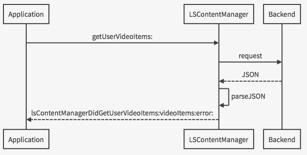
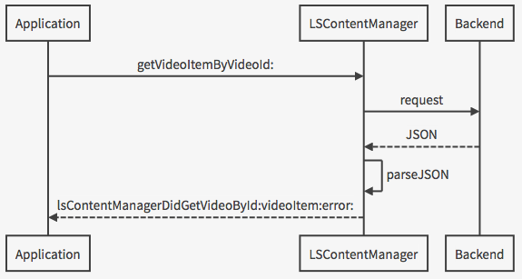
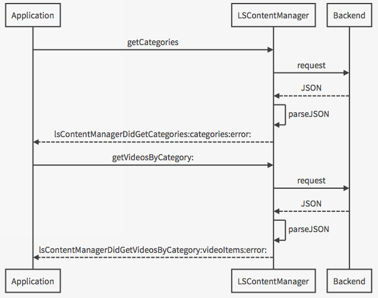

LittlStarSDK_iOS
==================

Introduction
-------

The Littlstar SDK is a developer library to easily build and implement mobile applications that utilize immersive **360° video** content that is hosted on the *Littlstar* back-end service (http://littlstar.com).

360° video is a special type of video that covers the complete surroundings of the camera. With the Littlstar SDK, 360° video can be included to mobile apps with three easy steps:

1. Content is **hosted** on the Littlstar back-end service. Point your web browser to http://littlstar.com, create a user account, and upload your 360° videos.
2. Content is **accessed** via the SDK in a manner that hides all the complexity. Request your videos with your user ID, and pick a video to be played from the video list response.
3. Content is **played** with a state-of-the-art 360° video player. Include the player fragment into your UI layout and initialize it with a video ID from your video list.

>**Tip:** This document provides information about the SDK basics and helps you to get started quickly by providing step-by-step instructions. The SDK also contains **API documentation** and a working sample application **Hello Littlstar** that can be used as a basis for a new 360° video app.

What's new
-------

Build 2.0.0, Jun 12, 2015:
* Updated API with several functions

Overview
-------

The Littlstar SDK provides a new iOS library that can be included to 3rd party iOS apps and that greatly simplifies building 360° video support to an app.

Playing a single 360° video from the Littlstar back-end requires only a few lines of code. This is achieved by providing a component for managing all communication with the Littlstar back-end service in an asynchronous manner (**LSContentManager**), and a 360° video player component that is integrated with the Littlstar back-end so that the player can be simply dropped in to a UI layout and initialized with a video ID (**LSPlayerView**).

To summarize, the Littlstar SDK contains the following main components and purpose:

1. **LSUser** is a data class that represents a single user who has signed up to the back-end.
2. **LSVideoItem** is a data class that represents a single video that is hosted on the back-end.
3. **LSPhotoItem** is a data class that represents a single photo that is hosted on the back-end.
4. **LSCategory** is a data class that represents a single video category of which videos can be requested in a separate call.
5. **LSContentManager** for accessing hosted 360° video content by making requests to the back-end.
6. **LSPlayerView** to view and play 360 degree video content.
7. **LSChannel** is a data class that represents a channel owned by a user.
8. **LSComment** is a data class that represents a comment on an item, video or photo.
9. **LSNotification** is a data class that represents a notification message (action) related to a specific user owned item.
10. **LSResultPage** is a data container delivering the result items through the API. 

These are covered in detail in the included API documentation. To get you started with ease, basic usage examples will be given in the following chapters with code snippets.

Requirements
----------------

The Littlstar SDK for iOS requires only the standard development environment for iOS apps. 

Supported Devices
----------------------

The Littlstar SDK for iOS supports all iOS devices starting iOS version 7.0.

License
-------
By default the SDK works as a **trial version**. To create your own applications, you must acquire a **license** file per each published application. In order to enable the Littlstar SDK 360 video features the right license file (e.g. com.littlstar.example-app.key.lic) needs to be included in the project. It needs to match the platform (at least "iOS"), application version (version=Littlstar) and the bundle ID of the application (e.g. com.littlstar.example-app).
An example header of a license file:

```
packagename=com.littlstar.example-app
enableFeatureExplicit=viewport_split
enableSourceUrlExplicit=https://littlstar.com/*
enableUnknownSourceUrl=false
logo=none
platform=ios
version=Littlstar
```

The license may also limit the access to the video service, other than Littlstar.com; 
if the *enableUnknownSourceUrl* is true also the other Littstar based services may be accessed and videos shown in application. Otherwise the access is limited to the sites under *enableSourceUrlExplicit*, e.g. http://littlstar.com/* as in the example.

>**Note:** The sample application contains a license file so it can be tested on a real hardware and used for learning and experimenting. However, modified sample app cannot be published to app stores.

#### 3rd Party Licenses & Acknowledgments

For legal reasons, you must include the following acknowledgment somewhere in your application's user interface (must be visible to users). Typically it is placed under "Info" or "About" section with a title "3rd Party Licenses & Acknowledgments".

Installation
-------

The easiest way to take the Littlstar SDK into use is to utilize the CocoaPods framework. CocoaPods takes care of all required frameworks and third party dependencies. 
First the Cocoapods framework needs to be installed, please check instructions: http://guides.cocoapods.org/using/getting-started.html#installation
To use Littlstar SDK in your project, run *pod install* in XCode project folder (where .xcp, add simply pod definition to your project podfile: *pod 'LittlstarSDK'* and finally update the dependencies in project by running *pod update*.

```
platform :ios, "7.0"
workspace 'Hello Littlstar'

target "Hello Littlstar" do
# Third party libs
pod 'LittlstarSDK'
pod 'SDWebImage', '~> 3.6'
end
```

Getting Started
------------------

##License File

To play 360° video you need a **license** file that must be copied to your app project's resources without any modifications. Failure to do so will result to black video player screen.

>**Tip:** If you don't have a license file (trial version of the SDK), you can import the sample app **Hello Littlstar** to your workspace and experiment with it until you purchase a license file for your own app.

###LSUser

A **LSUser** class describes details of a video user (a registered video service user who has loaded videos to server and/or owns the videos, or a service user who has registered to Littlstar service just to view and comment 360 videos). The class has the following properties; **lsUserName**, which is a user ID used for fetching the provider's  video list, **lsUserDisplayName** which describes the video owner name, **lsUserBio** which defines the owner's biography and **lsUserIconURL** which provides a URL to the provider's avatar icon. To use **LSUser** class, import header *LSUser.h*.


###LSVideoItem

A **LSVideoItem** object describes details of the 360 degree video data. It contains an unique video ID (**videoId**), which can be used to fetch or refresh the video data, video description (**desc**), title (**title**), URL to thumbnail image (**thumbURL**), number of all given stars (**stars**) and number of all given down-votes (**downvotes**). It also provides information whether a certain user has given a star (**stared**) or down-voted (**downvoted**) the video. Note that **stared** and **downvoted** properties are valid only when the user has been logged in. To use **LSVideoItem** class, import header *LSVideoItem.h*.

###LSPhotoItem

A **LSPhotoItem** object describes details of the 360 degree photo data. It contains an unique photo ID (**photoId**), which can be used to fetch or refresh the photo data, photo description (**desc**), title (**title**), URL to thumbnail image (**thumbURL**), number of all given stars (**stars**) and number of all given down-votes (**downvotes**). It also provides information whether a certain user has given a star (**stared**) or down-voted (**downvoted**) the photo. Note that **stared** and **downvoted** properties are valid only when the user has been logged in. To use **LSPhotoItem** class, import header *LSPhotoItem.h*.

###LSCategory

A **LSCategory** object describes the basic information of a Littlstar video category; it contains an unique category ID (**categoryId**), an unique category name (**categoryName**), a category title name (**categoryDisplayName**) and finally a video count per category (**categoryVideoCount**).

###LSChannel

A **LSChannel** object describes the basic information of a Littlstar channel; it contains a unique channelId (**channelId**), a unique title (**title**), counts of videos and photos included in channel (**videosCount**) (**photosCount**), creation date (**creationDate**), thumbnail URL (**thumbURL**) and channel owning user (**user**).

### LSComment

A **LSComment** object describes a simple comment given for a Littlstar service item, i.e. photo or video item. The object contains the text field (**text**), creation date (**creationDate**) and commented user (**user**).

### LSNotification

A **LSNotification** object describes a single action related to a user owned item. It contains a unique notificationId (**notificationId**), a string describing the action (**action**), the notification creation date (**creationDate**), the user owning the notification (**user**) and the notification text (**notification**).

###LSResultPage

A **LSResultPage** object is a mere data container of which content depends on the request done to the backend service. The object contains an array of collected items (**itemArray**), the current page number (**currentPage**), the next page available (**nextPage**) and total count of pages to be requested.

###LSContentManager

**LSContentManager** handles all communication with the Littlstar back-end service. ou use it for example for retrieving a list of available video items, logging in, and starring a great video. To use **LSContentManager** you need to import header *LSContentManager.h* into your project. Note that the license is needed to enable the Littlstar 360 video features (for more information check the chapter "License" above).

The *Content Manager* need to be initialized as follows:

```
LSContentManager manager = [[LSContentManager alloc] init];
manager.delegate = self;
NSString* path = [[NSBundle mainBundle] pathForResource:@"license.key.lic" ofType:nil];
NSURL *licenseURL = [NSURL fileURLWithPath:path];
[manager setLicenseFileURL:licenseURL]; // setting the license file is mandatory
```

Videos can be requested from the back-end for example with a *user ID* (get all videos that a particular user has uploaded). From now on we will call this user as *Video Provider User* to separate it from the actual user of the app who can log in, watch a few videos and perhaps star a video using his personal user account. The latter user we will call *Logged-in User*. Note that both are described by the same **LSUser** class.

To retrieve details of the *Video Provider User*, you request his **LSUser** object with a user ID (NSString) that could be for example "testprovider".

```
[manager getUser:userId];
```

Delegate method **lsContentManagerDidGetUser:user:error** is called when the *Video Provider User* has successfully been fetched. After this, the *Video Provider User*'s videos can be loaded by calling **getVideoItemsByUser:**.  Upon succesful loading, delegate method  **lsContentManagerDidGetVideoItemsByUser:videoItems:error:** provides on array containing the *Video Provider User*'s all video items.



To request single *Video Item* from the back-end, use **getVideoItemByVideoId:** method. Callback method **lsContentManagerDidGetVideoById:videoItem:error:** tells the delegate when the requested *Video Item* has been found. Similar functions are available for *Photo Item*.



After one or more *Video Items* has been received from the back-end,  you can select an **LSVideoItem** item to be played with the 360° player component (**LSPlayerView**), or show the details and retrieve thumbnail images of multiple **LSVideoItem** items in a user interface where the *Logged-in User* can select a video to be played. The similar functionality is available for *Photo Item*.

To request videos by category (i.e. sports, music, travel, design etc.), method **getVideosByCategory:** can be used. Note that gategory needs to be given as **LSCategory** object. Method **getCategories** can be used to get available categories. Similar functions can be found for *Photo Item*.



It's also possible to give a star (**starVideoItem:lsVideoItem**) and a downvote (**downvoteVideoItem:lsVideoItem**) to a *Video Item*.  Similar functions can be found for *Photo Item*. Note that giving stars or downvoting videos or photos requires that user must be logged in (*Logged-in User*). **LSContentManager** provides also methods to log in to an existing user account (**loginUser:password:**) as well as register a new user (**registerUser:email:password:confirmation:**).

###LSPlayerView

**LSPlayerView** is a simple UIView for viewing 360 degree video. To use LSPlayerView, you need to import *LSPlayerView.h* header. **LSPlayerView** is initialized as follows:

```
LSPlayerView lsPlayerView = [[LSPlayerView alloc] initWithFrame:CGRectMake(0, 0, self.view.bounds.size.width, self.view.bounds.size.height)];
lsPlayerView.delegate = self;
```

After this, you also need to initialize a selected *Video Item*. Note that same license file need to be given that was used in *Content Manager* initialization.

```
NSString* path = [[NSBundle mainBundle] pathForResource:@"license.key.lic" ofType:nil];
NSURL *licenseURL = [NSURL fileURLWithPath:path];
[lsPlayerView initVideoWithVideoItem::videoId contentManager:contentManager licenseFileUrl:licenseURL];
```

**LSPlayerView** delegate method **lsPlayerViewReadyToPlayVideo:** is called when the requested *Video Item* is ready to be played. Note that video starts playing only after **play:** method has been called (e.g. **[lsPlayerView play:0.0]** starts playing the requested video from the beginning). **LSPlayerView** also provides methods **pause**, **play**,  **seekTo:** and **isPaused**. Note that **LSPlayerView** inherits **UIView** and therefore inherits also properties and methods provided by UIView (e.g. setting the frame).


Next Steps
-------------

It is recommended to get familiar with the API documentation that is included in the SDK to learn more about the available features and how they should be used.

To jump start your project, take a look at the included sample app **Hello Littlstar**. Import the project to your workspace, build and run it on your device. Then look at the source code.

>**Note:** While the sample app is fully functional with basic features such as login, video gallery and video player, we have intentionally left out many trivial details (such as persistency for video position) and some complex programming challenges (such as memory-managed image gallery and downloader). While these are out of the scope of this SDK, some implementation tips are given in the sample application's source code.
